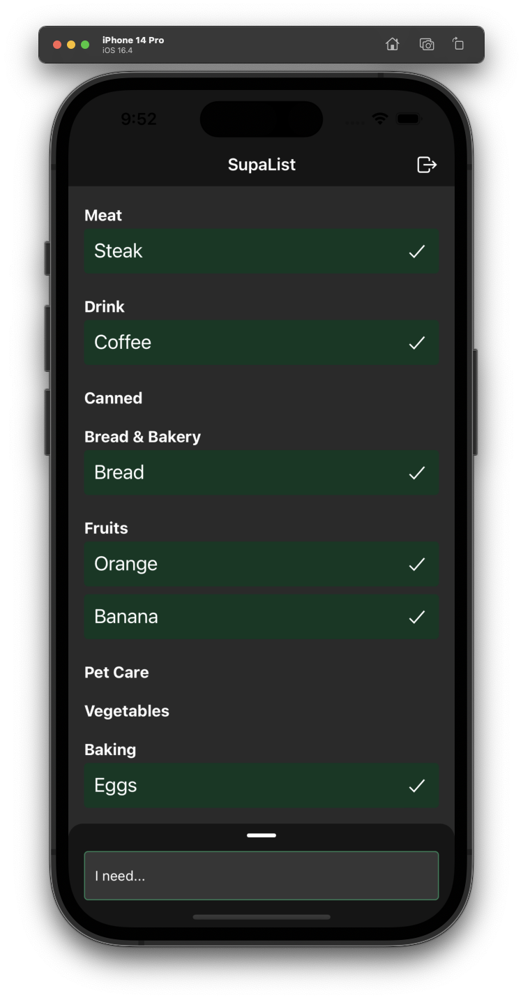

# AI Shopping List with React Native & Supabase

This is a React Native app that uses Supabase as a backend. It is a simple shopping list app that allows you to add items to a list and check them off when you buy them.

It's using the PGVector extension to store embeddings in Supabase and then compare new items to the embeddings of items in the database to find the closest match.

## Supabase

Find the migration and edge function in the `supabase` folder.

## App Screenshots

